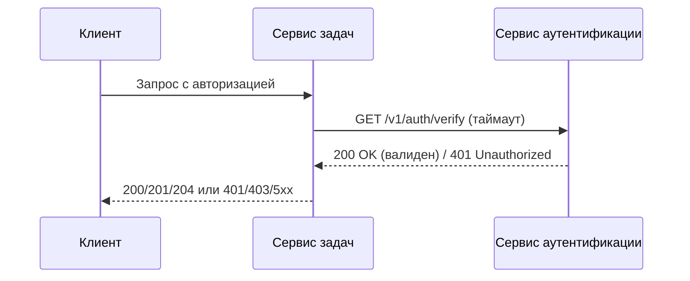

# Диаграмма последовательности для PZ17

```mermaid
sequenceDiagram
    participant C as Клиент
    participant T as Сервис задач
    participant A as Сервис аутентификации

    C->>T: Запрос с авторизацией
    T->>A: GET /v1/auth/verify (таймаут)
    A-->>T: 200 OK (валиден) / 401 Unauthorized
    T-->>C: 200/201/204 или 401/403/5xx
```